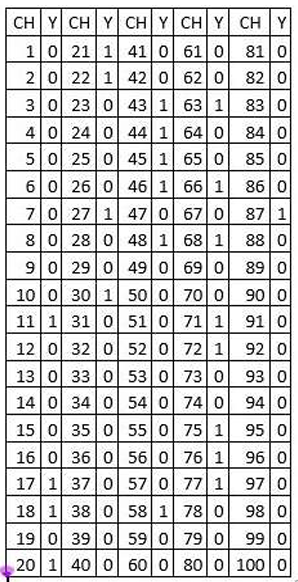

```{r setup, include=FALSE}
knitr::opts_chunk$set(echo = TRUE)
```

```{r Lectura de dataset, include=FALSE}
# Ingreso de la base de datos:
library(readxl)
DataSets <- read_excel("DataSets.xlsx")
```

\newpage

**Base de datos para el desarrollo del ejercicio:**



Las variables de nuestro dataset son:

-   `CH`: Hogares de un barrio en particular

-   `Y`: ¿Tienen niños menores de **5** años? $(1: SI \ | \ 0: NO)$

-   `N`: \# total de Hogares encuestados

-   `n`: tamaño de muestra seleccionada

# 1er Punto

Gracias a *R* utilizaremos el siguiente mecanismo para seleccionar numeros aleatorios del tamaño **N** de la muestra.

```{r echo=TRUE}
# Definimos una semilla para que nuestra muestra a seleccionar no cambie:
set.seed(1)

N <- 100

# Seleccionamos nuestra MAS con:
n <- 20
muestra <- sort(sample(1:N,n))

# Hogares seleccionados Aleatoriamente
print(muestra)
```

# 2do punto

## Aprox Binomial

para estimar la proporción necesitamos los siguientes datos:

-   **a**: \# de Exitos observados en la muestra (en este caso, hogares con niños menores de 5 años).

```{r}
# Creamos nuestro nuevo dataset a partir de "muestra":

df <- DataSets[muestra,]
print(df)

# Observamos los hogares que tienen niños menores de 5 años:

which(df[,2] == 1)
```

Ahora hacemos un conteo de cuantos hogares reflejan casos de *1*.

```{r}
# Numero de exitos en nuestra muestra
a <- length(which(df[,2] == 1))
print(a)
```

Son 4 hogares dentro de la muestra que presentan la propiedad de interés.

Ya teniendo todo listo podemos proceder para hallar el I.C.

```{r funciones, include=FALSE}
# Definimos funciones para el calculo de los limites superiores e infereriores
Ls.conf.binom.prop <- function(pp,a,alfa,n){
  pbinom(a,size = n, prob = pp)-alfa*0.5
}

Li.conf.binom.prop <- function(pp,a,alf,n){
  1-pbinom(a-1,size = n, prob = pp)-alf/2
}
```

```{r DatosView, include=FALSE}
#Definimos nuestros valores antes generados:
print("## Numero de exitos")
print(a)
print("## tamaño de muestra")
print(n)
print("## Tamaño total de la población")
print(N)

print("## Ya que nuestro nuvel de confianza es del 98% etonces nuestro alfa sera del:")
alf <- 0.02
```

```{r Intervalos de Busqueda, include=FALSE}
#Ahora definimos nuestros intervalos de busqueda:

intervalolsb <- seq(a/n, 1,0.0001)
intervalolib <- seq(0,a/n,0.0001)

ysb <- apply(matrix(intervalolsb,ncol=1), 1,
            Ls.conf.binom.prop,a,alf,n)

yib <- apply(matrix(intervalolib,ncol=1), 1,
            Li.conf.binom.prop,a,alf,n)
```

```{r grafica binom, echo=FALSE}
library(ggplot2)
library(gridExtra)
# Hacemos los respectivos graficos de los intervalos de busqueda:
p1 <- ggplot(,aes(intervalolsb,ysb))+geom_line(size=1, colour="red")+
  geom_hline(yintercept = 0, colour="blue")+
  labs(title = "Intervalo Superior [Binom]")

p2 <- ggplot(,aes(intervalolib,yib))+geom_line(size=1, colour="green")+
  geom_hline(yintercept = 0, colour="blue")+
  labs(title = "Intervalo Inferior [Binom]")

grid.arrange(p2,p1,ncol=2)
```

```{r echo=FALSE}
# Observamos que nuestro Intervalo de Confianza para la binomial es:
#Upper
ind1 <- which((abs(ysb)<0.0001))

print("#  pp   Error comparado  con alfa/2 = 0.01")
mb1 <- matrix(c(intervalolsb[ind1],ysb[ind1]), ncol = 2)
print(mb1)
maxb <- mb1[abs(mb1[,2])==min(abs(mb1[,2])),]
maxb <- maxb[1]

#Lower
ind2 <- which((abs(yib)<0.0001))

print("#  pp   Error comparado  con alfa/2 = 0.01")
mb2 <- matrix(c(intervalolsb[ind2],yib[ind2]), ncol = 2)
print(mb2)
minb <- mb2[abs(mb2[,2])==min(abs(mb2[,2])),]
minb <- minb[1]
```

Escogiendo el menor (de la columna 2) de cada uno de las 2 matrices mostradas anteriormente tenemos que, nuestro **Intervalo de Confianza** por medio de la aproximación binomial es:

```{r echo=FALSE}
paste("(", minb, ",", maxb,")")
```

## Aprox Hyper

```{r}
# Agregamos unas nuevas funciones que dependan de la distribución Hypergeometrica:
Ls.conf.hiper.prop <- function(A,a,N,n,alfa){
  phyper(a,A,N-A,n)-alfa*0.5
}

Li.conf.hiper.prop <- function(A,a,N,n,alf){
  1-phyper(a-1,A,N-A,n)-alf/2
}
```

ya habiendo definido de antemano nuestros valores `a`, `n`,`N` y $\alpha = 0.02$ procedemos a replicar el codigo de "manera similar" al anterior:

```{r include=FALSE}
#Ahora definimos nuestros intervalos de busqueda:

intervalolsh <- seq(a/n *N, 100,1)
intervalolih <- seq(0,a/n * N,1)

ysh <- apply(matrix(intervalolsh,ncol=1), 1,
            Ls.conf.hiper.prop,a,N,n,alf)

yih <- apply(matrix(intervalolih,ncol=1), 1,
            Li.conf.hiper.prop,a,N,n,alf)
```

```{r echo=FALSE}
# Hacemos los respectivos graficos de los intervalos de busqueda:
p1 <- ggplot()+geom_line(aes(intervalolsh, ysh),colour="red")+
  geom_hline(yintercept = 0, colour="blue")+
  labs(title = "Intervalo Superior [Hyper]")

p2 <- ggplot(,aes(intervalolih,yih))+geom_line(size=1, colour="green")+
  geom_hline(yintercept = 0, colour="blue")+
  labs(title = "Intervalo Inferior [Hyper]")

grid.arrange(p2,p1,ncol=2)
```

```{r echo=FALSE}
# Observamos que nuestro Intervalo de Confianza para la Hypergeometrica es:
#Upper
ind1 <- which((abs(ysh)<0.01))

print("#  pp   Error comparado  con alfa/2 = 0.01")
mh1 <- matrix(c(intervalolsh[ind1],ysh[ind1]), ncol = 2)
print(mh1)
maxh <- mh1[abs(mh1[,2])==min(abs(mh1[,2])),]
maxh <- maxh[1]

#Lower
ind2 <- which((abs(yih)<0.01))

print("#  pp   Error comparado  con alfa/2 = 0.01")
mh2 <- matrix(c(intervalolsh[ind2],yih[ind2]), ncol = 2)
print(mh2)
minh <- mh2[abs(mh2[,2])==min(abs(mh2[,2])),]
minh <- minh[1]
```

Escogiendo el menor (de la columna 2) de cada uno de las 2 matrices mostradas anteriormente tenemos que, nuestro **Intervalo de Confianza** por medio de la aproximación hypergeometrica es:

```{r echo=FALSE}
paste("(", minh/N, ",", maxh/N,")")
```

# Punto 3

## Utilizando la aproximación binomial:

```{r echo=FALSE}
##para el caso de la aproximacion binomial tenemos:
snt <- ceiling(maxb*N)
int <- ceiling(minb*N)

print("## Así un intervalo de confianza está dado por:")
cat("(",int,",",snt,")")
```

## Utilizando la aproximación hypergeometrica.

```{r echo=FALSE}
snA <- maxh
inA <- minh
print("## Así un intervalo de confianza está dado por:")
cat("(",inA,",",snA,")")
```

# Punto 4

Para concluir se toma como criterio la longitud del intervalo, con esto podemos observar su presición por tanto el intervalo más preciso es:

-   para el caso de la **binomial**: Restamos

```{r echo=FALSE}
print("#Prop" )
maxb-minb

print("# Total")
snt-int
```

-   para el caso de la **hipergeometrica**:

```{r echo=FALSE}
print("#Prop" )
maxh/N-minh/N

print("# Total")
snA-inA
```

Viendo los anteriores resultados el caso de la Aprox. hipergeometrica tiene menor longitud en contra parte con el de la aprox. binomial por tanto el mejor intervalo para estimar el parametro de la proporción y el total sera el de la aprox. hipergeometrica.

```{r eval=FALSE, include=FALSE}
knitr::purl("Tarea_1.Rmd", "Tarea_1.r")
```
